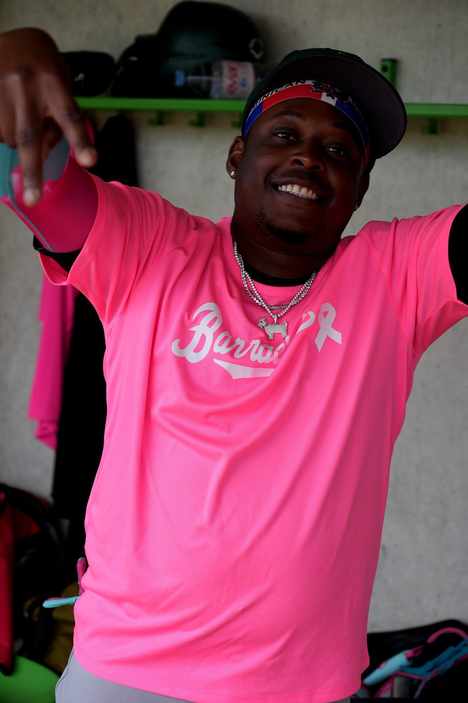

# TASK: News Carousel in Hero Section + Pink Game Article

## CONTEXT
This is the Zürich Barracudas 3 website (barracudas3/).
Stack: pure HTML/CSS/JS, no frameworks.
Files involved: `index.html`, `styles.css`, `app.js`, `news.html`

---

## PART 1 — Add `pink-game-recap.html`

Copy the file `pink-game-recap.html` (provided separately) into the project root:
```
barracudas3/pink-game-recap.html
```

---

## PART 2 — News articles data system in `app.js`

Add a `NEWS_ARTICLES` array at the top of app.js (or in a dedicated section).
This is the single source of truth — every time there's a new article, just add an entry here:

```js
const NEWS_ARTICLES = [
  {
    id: 'pink-game-may5',
    date: 'May 5, 2026',
    tag: '🩷 Pink Game',
    tagColor: '#FF3EA5',
    headline: 'Barracudas 3 Fall 17–5 in Pink Game as NLA Squad Proves Too Strong',
    summary: 'Under the lights of Heerenschürli, the Barracudas 3 donned their pink uniforms for breast cancer awareness — but the NLA squad had other plans, running away with a 17–5 victory.',
    image: 'assets/news-pink-game-02.jpg',
    href: 'pink-game-recap.html',
    featured: true,
  },
  // ← Future articles go here, newest first
];
```

---

## PART 3 — Hero Section News Carousel in `index.html` + `styles.css` + `app.js`

### 3a. HTML — Add inside the existing hero section, BELOW the hero content/tagline:

```html
<!-- NEWS TICKER / CAROUSEL -->
<div class="hero-news" id="heroNews">
  <div class="hero-news-label">
    <span class="hero-news-dot"></span>
    LATEST NEWS
  </div>
  <div class="hero-news-track" id="heroNewsTrack">
    <!-- JS renders slides here -->
  </div>
  <div class="hero-news-controls">
    <button class="hero-news-btn" id="heroNewsPrev" aria-label="Previous">‹</button>
    <div class="hero-news-dots" id="heroNewsDots"></div>
    <button class="hero-news-btn" id="heroNewsNext" aria-label="Next">›</button>
  </div>
</div>
```

### 3b. CSS — Add to `styles.css`:

```css
/* ── HERO NEWS CAROUSEL ── */
.hero-news {
  position: absolute;
  bottom: 0;
  left: 0;
  right: 0;
  background: linear-gradient(to top, rgba(13,46,26,0.97) 0%, rgba(13,46,26,0.7) 100%);
  padding: 1.25rem clamp(1.5rem, 5vw, 4rem);
  display: flex;
  align-items: center;
  gap: 1.25rem;
  overflow: hidden;
}

.hero-news-label {
  display: flex;
  align-items: center;
  gap: 0.5rem;
  font-family: 'JetBrains Mono', monospace;
  font-size: 0.6rem;
  font-weight: 600;
  letter-spacing: 0.14em;
  text-transform: uppercase;
  color: var(--accent);
  white-space: nowrap;
  flex-shrink: 0;
}

.hero-news-dot {
  width: 6px;
  height: 6px;
  border-radius: 50%;
  background: var(--accent);
  animation: pulse-dot 1.8s ease-in-out infinite;
}

@keyframes pulse-dot {
  0%, 100% { opacity: 1; transform: scale(1); }
  50% { opacity: 0.4; transform: scale(0.7); }
}

.hero-news-track {
  flex: 1;
  overflow: hidden;
  position: relative;
  min-height: 56px;
}

.hero-news-slide {
  display: none;
  align-items: center;
  gap: 1rem;
  text-decoration: none;
  color: inherit;
  cursor: pointer;
  transition: opacity 0.3s ease;
}

.hero-news-slide.active {
  display: flex;
}

.hero-news-slide:hover .hero-news-headline {
  color: var(--accent);
}

.hero-news-thumb {
  width: 72px;
  height: 50px;
  object-fit: cover;
  object-position: center top;
  border-radius: 3px;
  flex-shrink: 0;
  border: 1px solid rgba(255,255,255,0.08);
}

.hero-news-text {
  display: flex;
  flex-direction: column;
  gap: 0.2rem;
  min-width: 0;
}

.hero-news-tag {
  font-family: 'JetBrains Mono', monospace;
  font-size: 0.6rem;
  letter-spacing: 0.1em;
  text-transform: uppercase;
}

.hero-news-headline {
  font-family: 'Anton', sans-serif;
  font-size: clamp(0.85rem, 1.8vw, 1.1rem);
  line-height: 1.2;
  letter-spacing: 0.02em;
  text-transform: uppercase;
  color: #f8f8f6;
  white-space: nowrap;
  overflow: hidden;
  text-overflow: ellipsis;
  transition: color 0.2s ease;
}

.hero-news-meta {
  font-family: 'JetBrains Mono', monospace;
  font-size: 0.58rem;
  color: rgba(255,255,255,0.4);
  letter-spacing: 0.06em;
}

.hero-news-controls {
  display: flex;
  align-items: center;
  gap: 0.6rem;
  flex-shrink: 0;
}

.hero-news-btn {
  background: rgba(255,255,255,0.08);
  border: 1px solid rgba(255,255,255,0.12);
  color: #fff;
  width: 28px;
  height: 28px;
  border-radius: 50%;
  font-size: 1rem;
  line-height: 1;
  cursor: pointer;
  display: flex;
  align-items: center;
  justify-content: center;
  transition: background 0.2s ease;
}

.hero-news-btn:hover {
  background: var(--accent);
  border-color: var(--accent);
  color: #000;
}

.hero-news-dots {
  display: flex;
  gap: 4px;
}

.hero-news-dot-btn {
  width: 5px;
  height: 5px;
  border-radius: 50%;
  background: rgba(255,255,255,0.25);
  border: none;
  cursor: pointer;
  padding: 0;
  transition: background 0.2s ease, transform 0.2s ease;
}

.hero-news-dot-btn.active {
  background: var(--accent);
  transform: scale(1.3);
}

/* Hide carousel if no articles */
.hero-news:empty { display: none; }

@media (max-width: 600px) {
  .hero-news { flex-wrap: wrap; gap: 0.75rem; }
  .hero-news-thumb { width: 52px; height: 38px; }
  .hero-news-headline { font-size: 0.78rem; }
  .hero-news-label { font-size: 0.55rem; }
}
```

### 3c. JavaScript — Add to `app.js`:

```js
// ── HERO NEWS CAROUSEL ──────────────────────────────────────
function initHeroNewsCarousel() {
  const track = document.getElementById('heroNewsTrack');
  const dotsContainer = document.getElementById('heroNewsDots');
  const prevBtn = document.getElementById('heroNewsPrev');
  const nextBtn = document.getElementById('heroNewsNext');
  const heroNews = document.getElementById('heroNews');

  if (!track || !NEWS_ARTICLES.length) {
    if (heroNews) heroNews.style.display = 'none';
    return;
  }

  let current = 0;
  let autoTimer;

  // Render slides
  track.innerHTML = NEWS_ARTICLES.map((article, i) => `
    <a class="hero-news-slide${i === 0 ? ' active' : ''}" href="${article.href}" target="_self">
      
      <div class="hero-news-text">
        <span class="hero-news-tag" style="color:${article.tagColor || 'var(--accent)'};">${article.tag}</span>
        <span class="hero-news-headline">${article.headline}</span>
        <span class="hero-news-meta">${article.date} &nbsp;·&nbsp; Read more →</span>
      </div>
    </a>
  `).join('');

  // Render dots
  dotsContainer.innerHTML = NEWS_ARTICLES.map((_, i) => `
    <button class="hero-news-dot-btn${i === 0 ? ' active' : ''}" aria-label="Go to article ${i+1}"></button>
  `).join('');

  const slides = track.querySelectorAll('.hero-news-slide');
  const dots = dotsContainer.querySelectorAll('.hero-news-dot-btn');

  function goTo(index) {
    slides[current].classList.remove('active');
    dots[current].classList.remove('active');
    current = (index + NEWS_ARTICLES.length) % NEWS_ARTICLES.length;
    slides[current].classList.add('active');
    dots[current].classList.add('active');
  }

  function startAuto() {
    autoTimer = setInterval(() => goTo(current + 1), 5000);
  }

  function resetAuto() {
    clearInterval(autoTimer);
    startAuto();
  }

  prevBtn.addEventListener('click', () => { goTo(current - 1); resetAuto(); });
  nextBtn.addEventListener('click', () => { goTo(current + 1); resetAuto(); });
  dots.forEach((dot, i) => dot.addEventListener('click', () => { goTo(i); resetAuto(); }));

  // Hide controls if only 1 article
  if (NEWS_ARTICLES.length === 1) {
    document.getElementById('heroNewsNext').style.display = 'none';
    document.getElementById('heroNewsPrev').style.display = 'none';
  }

  startAuto();
}

// Call on DOM ready (add to your existing DOMContentLoaded or call directly)
document.addEventListener('DOMContentLoaded', initHeroNewsCarousel);
```

---

## PART 4 — news.html card for Pink Game

In `news.html`, ensure there is a card/article entry for the Pink Game that links to `pink-game-recap.html`.
If a `.news-grid` or `.articles-grid` already exists, prepend this card:

```html
<a class="news-card featured" href="pink-game-recap.html">
  <div class="news-card-img-wrap">
    
    <span class="news-card-tag" style="background:#FF3EA5;">🩷 Pink Game</span>
  </div>
  <div class="news-card-body">
    <div class="news-card-meta">May 5, 2026 &nbsp;·&nbsp; Game Recap</div>
    <h2 class="news-card-title">Barracudas 3 Fall 17–5 in Pink Game as NLA Squad Proves Too Strong</h2>
    <p class="news-card-summary">Under the lights of Heerenschürli, the Barracudas 3 donned their pink uniforms for breast cancer awareness — but the NLA squad had other plans.</p>
    <span class="news-card-read">Read Recap →</span>
  </div>
</a>
```

---

## HOW TO ADD FUTURE ARTICLES (instructions for the dev)

When there's a new game recap or news article:
1. Add the new article object at the TOP of `NEWS_ARTICLES` array in `app.js` (newest first)
2. Set `featured: true` on the one you want highlighted first in carousel
3. Add the corresponding card in `news.html`
4. The hero carousel updates automatically — no other changes needed

---

## FILES TO MODIFY
- `app.js` → add NEWS_ARTICLES array + initHeroNewsCarousel()
- `index.html` → add .hero-news HTML inside hero section
- `styles.css` → add hero news carousel styles
- `news.html` → add Pink Game card at top of articles grid
- Add `pink-game-recap.html` to project root
